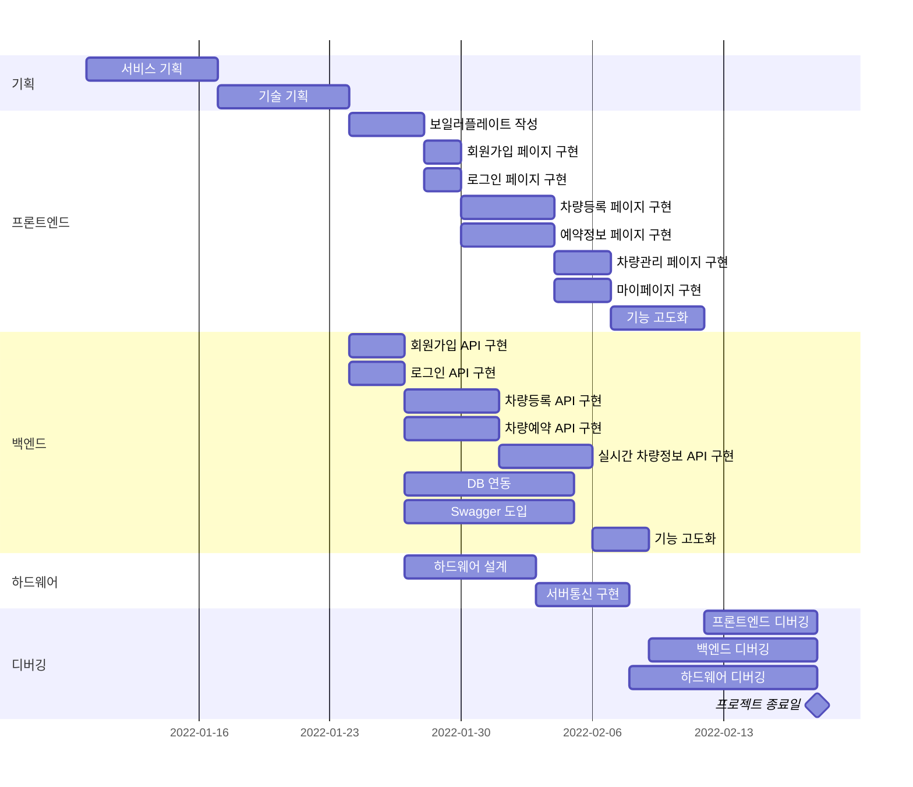

# SSAFY 공통 IoT 프로젝트 "차키줘바"

<!-- 필수 항목 -->

## 카테고리

| Application | Domain | Language | Framework |
| ---- | ---- | ---- | ---- |
| :white_check_mark: Desktop Web | :black_square_button: AI | :white_check_mark: JavaScript | :black_square_button: Vue.js |
| :white_check_mark: Mobile Web | :black_square_button: Big Data | :black_square_button: TypeScript | :white_check_mark: React |
| :white_check_mark: Responsive Web | :black_square_button: Blockchain | :black_square_button: C/C++ | :black_square_button: Angular |
| :black_square_button: Android App | :white_check_mark: IoT | :black_square_button: C# | :white_check_mark: Node.js |
| :black_square_button: iOS App | :black_square_button: AR/VR/Metaverse | :white_check_mark: ​Python | :black_square_button: Flask/Django |
| :black_square_button: Desktop App | :black_square_button: Game | :black_square_button: Java | :black_square_button: Spring/Springboot |
| | | :black_square_button: Kotlin | :white_check_mark: Next.js |

<!-- 필수 항목 -->

## 프로젝트 소개


* 프로젝트명: 차키줘바
* 서비스 특징: 라즈베리파이를 IoT 디바이스로 활용하여 개인간의 차량 공유를 가능하게 하는 플랫폼
* 주요 기능
  - 회원 관리
  - 차량 등록 및 예약 관리
  - 차량 실시간 정보 수집 및 제어
  - 커뮤니티 및 신고 서비스 제공
* 주요 기술
  - React + Next.js
  - Raspberry Pi
  - REST API
  - Node.js
  - MySQL
  - AWS EC2 + NGINX
  - Docker + Jenkins
* 참조 리소스
  * Material-UI: React Component Library
  * mui/material: React Component Library
  * www.creative-tim.com/templates/react-free: UI template
* 배포 환경
  - URL: https://i6a104.p.ssafy.io// 웹 서비스, 랜딩 페이지, 프로젝트 소개 등의 배포 URL 기입
  - 테스트 계정: // 로그인이 필요한 경우, 사용 가능한 테스트 계정(ID/PW) 기입

<!-- 자유 양식 -->

## 프로젝트 상세 설명

1. 프론트

> [프론트 상세설명으로 이동](https://lab.ssafy.com/s06-webmobile3-sub2/S06P12A104/-/blob/develop/frontend/README.md/)

2. 백엔드

> [백엔드 상세설명으로 이동](https://lab.ssafy.com/s06-webmobile3-sub2/S06P12A104/-/blob/develop/backend/README.md/)

3. 하드웨어

> [하드웨어 상세설명으로 이동](https://lab.ssafy.com/s06-webmobile3-sub2/S06P12A104/-/blob/develop/hw/README.md/)

## 업무 흐름도



## 실행 방법

서버
```bash
$ cd backend
$ npm install
$ npx nodemon server.js (debug)
$ pm2 start server.js (live/background)
```
프론트
```bash
$ cd frontend
$ npm install
$ npm run start
```
> 프론트에서 Critial vulnerability가 나온다면 ``npm audit fix --force`` 명령어를 사용하여 오류를 수정.  
> high, critical 레벨의 오류가 아니라면 진행 가능하다.

정상적으로 진행될 경우 3000번 port에서 진행된다.
