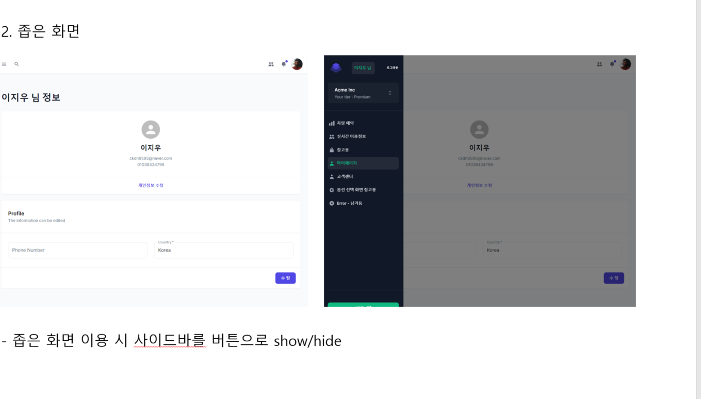

# 프론트엔드

저희 프로젝트의 프론트는 React로 만드는 서버사이드 렌더링 프레인 워크인 nextjs로 만들었습니다.

# 구조 및 참조 라이브러리
|  |
- 폴더 구조 설명
	+ src
		+ api `base_url과 axios를 활용해 API 호출 함수를 정의`
		+ components `전체적인 레이아웃과 페이지 구성요소 components를 정의`
		+ config `API 관련 정보들을 정의`
		+ context `state를 전역적으로 활용하고 dispatch하기 위한 context관련 파일 정의`
		+ icon `활용한 아이콘 정의`
		+ pages `라우팅될 페이지들 정의`
		+ theme `전반적인 UI에 적용할 디자인 정의`
		+ util `기타 요소들`

#  화면 레이아웃 설명

|  |
|  |

