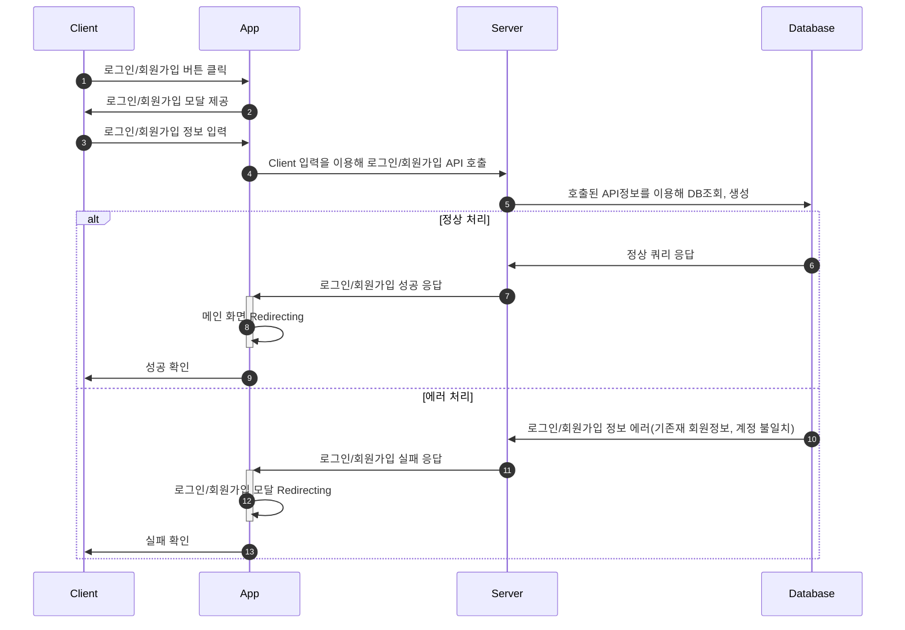
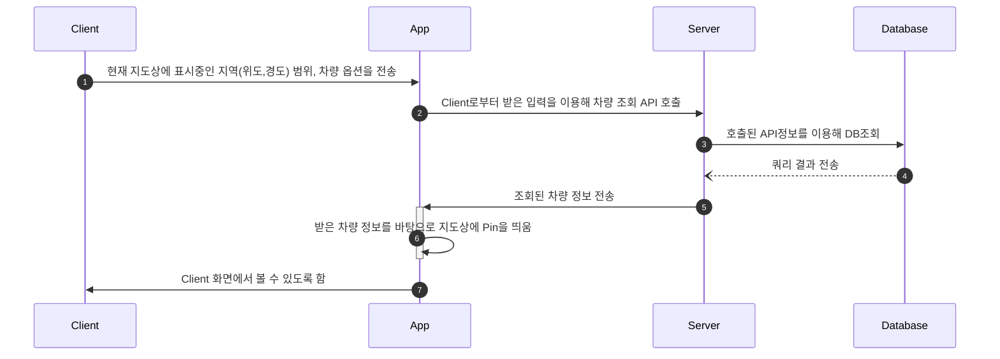
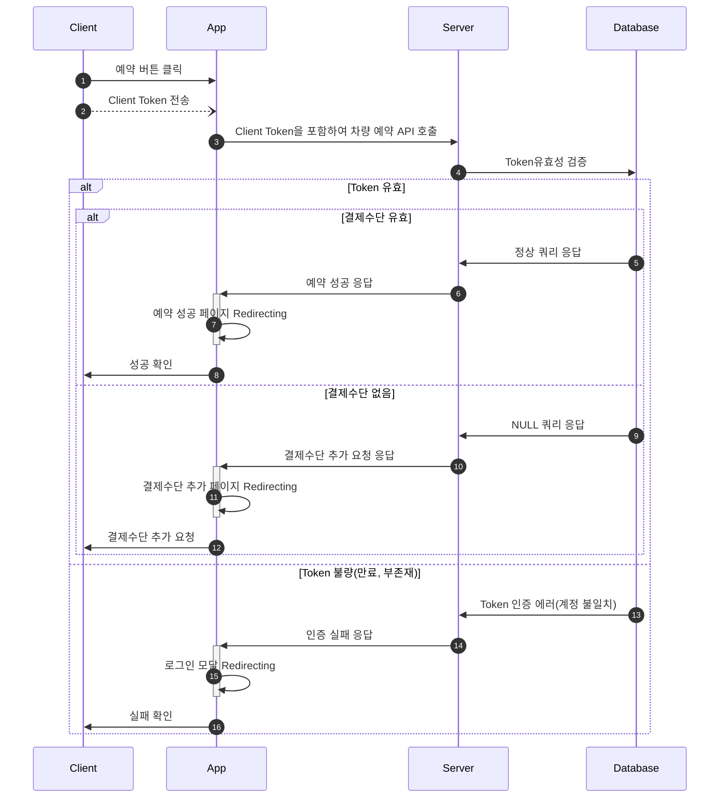
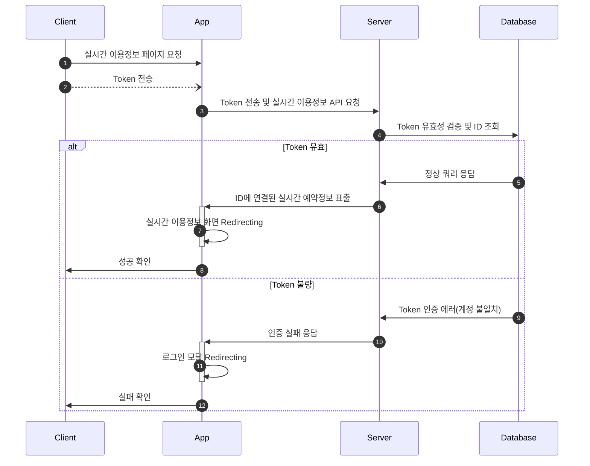
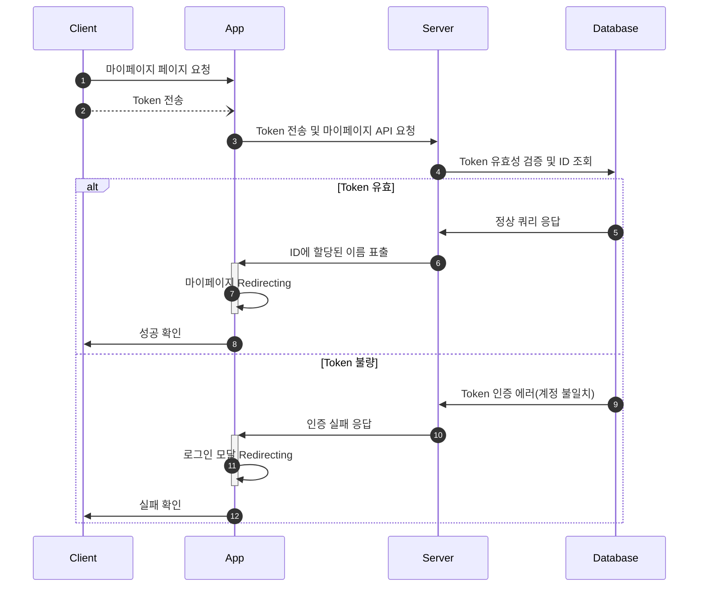
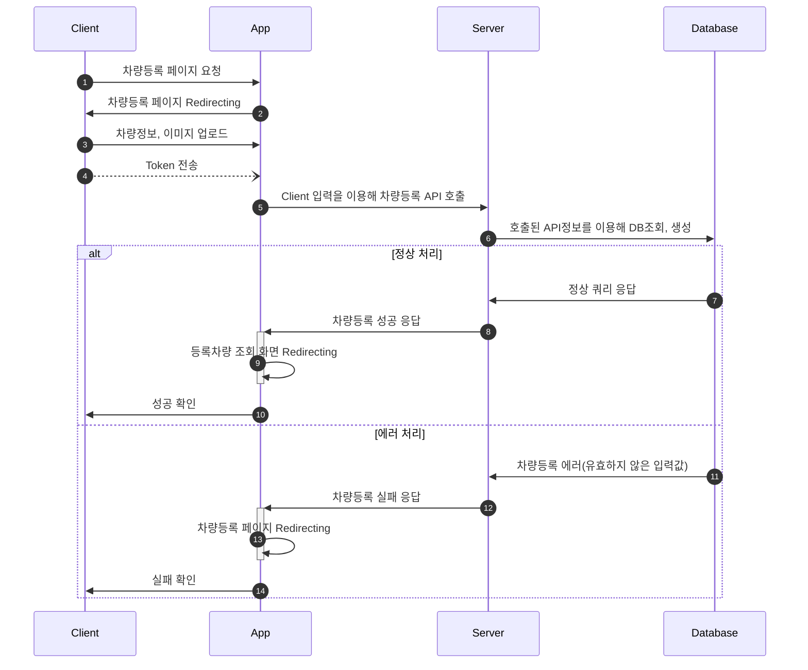

# 시퀀스 다이어그램

## 로그인/회원가입

고객이 로그인/회원가입을 하는 과정을 그린 시퀀스 다이어그램

```mermaid
sequenceDiagram
    autonumber
    participant A as Client
    participant B as App
    participant C as Server
    participant D as Database
    A->>B:로그인/회원가입 버튼 클릭
    B->>A:로그인/회원가입 모달 제공
    A->>B:로그인/회원가입 정보 입력
    B->>C:Client 입력을 이용해 로그인/회원가입 API 호출
    C->>D:호출된 API정보를 이용해 DB조회, 생성
    alt 정상 처리
        D->>C:정상 쿼리 응답
        C->>+B:로그인/회원가입 성공 응답
        B->>-B:메인 화면 Redirecting
        B->>A:성공 확인
    else 에러 처리
        D->>C:로그인/회원가입 정보 에러(기존재 회원정보, 계정 불일치)
        C->>+B:로그인/회원가입 실패 응답
        B->>-B:로그인/회원가입 모달 Redirecting
        B->>A:실패 확인
    end
```

## 지도 조회

지도를 통해 예약가능차량을 조회하는 과정을 그린 시퀀스 다이어그램

```mermaid
sequenceDiagram
    autonumber
    participant A as Client
    participant B as App
    participant C as Server
    participant D as Database
    A->>B:현재 지도상에 표시중인 지역(위도,경도) 범위, 차량 옵션을 전송
    B->>C:Client로부터 받은 입력을 이용해 차량 조회 API 호출
    C->>D:호출된 API정보를 이용해 DB조회
    D--)C:쿼리 결과 전송
    C->>+B:조회된 차량 정보 전송
    B->>-B:받은 차량 정보를 바탕으로 지도상에 Pin을 띄움
    B->>A:Client 화면에서 볼 수 있도록 함
```

## 차량 예약

```mermaid
sequenceDiagram
    autonumber
    participant A as Client
    participant B as App
    participant C as Server
    participant D as Database
    A->>B:예약 버튼 클릭
    A--)B:Client Token 전송
    B->>C:Client Token을 포함하여 차량 예약 API 호출
    C->>D:Token유효성 검증
    alt Token 유효
        alt 결제수단 유효
            D->>C:정상 쿼리 응답
            C->>+B:예약 성공 응답
            B->>-B:예약 성공 페이지 Redirecting
            B->>A:성공 확인
        else 결제수단 없음
            D->>C:NULL 쿼리 응답
            C->>+B:결제수단 추가 요청 응답
            B->>-B:결제수단 추가 페이지 Redirecting
            B->>A:결제수단 추가 요청
        end  
    else Token 불량(만료, 부존재)
        D->>C:Token 인증 에러(계정 불일치)
        C->>+B:인증 실패 응답
        B->>-B:로그인 모달 Redirecting
        B->>A:실패 확인
    end
```

## 실시간 이용정보

```mermaid
sequenceDiagram
    autonumber
    participant A as Client
    participant B as App
    participant C as Server
    participant D as Database
    A->>B:실시간 이용정보 페이지 요청
    A--)B:Token 전송
    B->>C:Token 전송 및 실시간 이용정보 API 요청
    C->>D:Token 유효성 검증 및 ID 조회
    alt Token 유효
        D->>C:정상 쿼리 응답
        C->>+B:ID에 연결된 실시간 예약정보 표출
        B->>-B:실시간 이용정보 화면 Redirecting
        B->>A:성공 확인
    else Token 불량
        D->>C:Token 인증 에러(계정 불일치)
        C->>+B:인증 실패 응답
        B->>-B:로그인 모달 Redirecting
        B->>A:실패 확인
    end
```

## 마이페이지

```mermaid
sequenceDiagram
    autonumber
    participant A as Client
    participant B as App
    participant C as Server
    participant D as Database
    A->>B:마이페이지 페이지 요청
    A--)B:Token 전송
    B->>C:Token 전송 및 마이페이지 API 요청
    C->>D:Token 유효성 검증 및 ID 조회
    alt Token 유효
        D->>C:정상 쿼리 응답
        C->>+B:ID에 할당된 이름 표출
        B->>-B:마이페이지 Redirecting
        B->>A:성공 확인
    else Token 불량
        D->>C:Token 인증 에러(계정 불일치)
        C->>+B:인증 실패 응답
        B->>-B:로그인 모달 Redirecting
        B->>A:실패 확인
    end
```

## 차량등록

```mermaid
sequenceDiagram
    autonumber
    participant A as Client
    participant B as App
    participant C as Server
    participant D as Database
    A->>B:차량등록 페이지 요청
    B->>A:차량등록 페이지 Redirecting
    A->>B:차량정보, 이미지 업로드
    A--)B:Token 전송
    B->>C:Client 입력을 이용해 차량등록 API 호출
    C->>D:호출된 API정보를 이용해 DB조회, 생성
    alt 정상 처리
        D->>C:정상 쿼리 응답
        C->>+B:차량등록 성공 응답
        B->>-B:등록차량 조회 화면 Redirecting
        B->>A:성공 확인
    else 에러 처리
        D->>C:차량등록 에러(유효하지 않은 입력값)
        C->>+B:차량등록 실패 응답
        B->>-B:차량등록 페이지 Redirecting
        B->>A:실패 확인
    end
```
